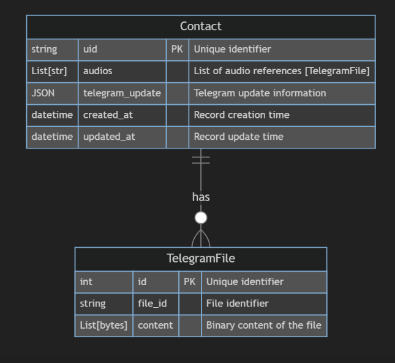

# Telegram Bot Contact Manager with Docker

## Overview
This Dockerized Telegram Bot Contact Manager simplifies interactions between a Telegram bot and its users. It's perfect for development and debugging, thanks to its Docker integration and local server capabilities.

## Key Features

- **Docker Integration**: Ensures a consistent environment using Docker containers.
- **Local File Storage**: Offers the option to store files locally or in binary format in a database.
- **Cloudflare Tunneling**: Leverages Cloudflare for secure, local tunneling, enhancing debugging and development.
- **API Accessibility**: The API is hosted locally, facilitating easy access and testing.
- **Database Structure and File Management**:

    
    
    Storing Contact Information and Audio Files
    In our application, we have a well-structured system for handling contact information and audio files. Here's how it works:

    Contact Row: Each contact is stored in a unique row within our contacts table. This row includes crucial information about the contact, along with a file_id which is a reference to an associated audio file stored in a different table.

    File Storage and Binary Content: Audio files, specifically in WAV format, are converted and stored as binary content in our files table. This approach ensures efficient storage and quick retrieval of audio data. By storing the files in binary format, we optimize space and maintain the quality of the audio files.

    Foreign Key Relationship: We establish a relational link between the contacts and files tables using a foreign key. This foreign key in the contacts table corresponds to the file_id in the files table, creating a direct connection between a contact and its associated audio file. This structure is key to maintaining data integrity and simplifying file access.

    This database architecture allows for an organized, efficient, and scalable system for managing contacts and their associated audio files.

## Components

1. **TextProcessor**: Manages text message interactions.
2. **PhotoProcessor**: Handles photo processing with face detection features.
3. **VoiceProcessor**: Converts voice messages to a standard audio format and stores them.
4. **ContactManager**: Keeps track of user contacts and manages data within the database.

## Setup and Usage

### Prerequisites
- Docker and Docker Compose installed.
- Cloudflare account for tunneling setup.

### Installation
1. Clone the repository.
2. Navigate to the project directory.
3. Use Docker Compose to build and run the containers.

    ```bash
    docker-compose up --build
    ```

### Usage
- Interact with the Telegram bot by sending text, photo, or voice messages.
- Use the local API for testing and debugging.
- Utilize Cloudflare tunneling for a secure connection to the local server.
